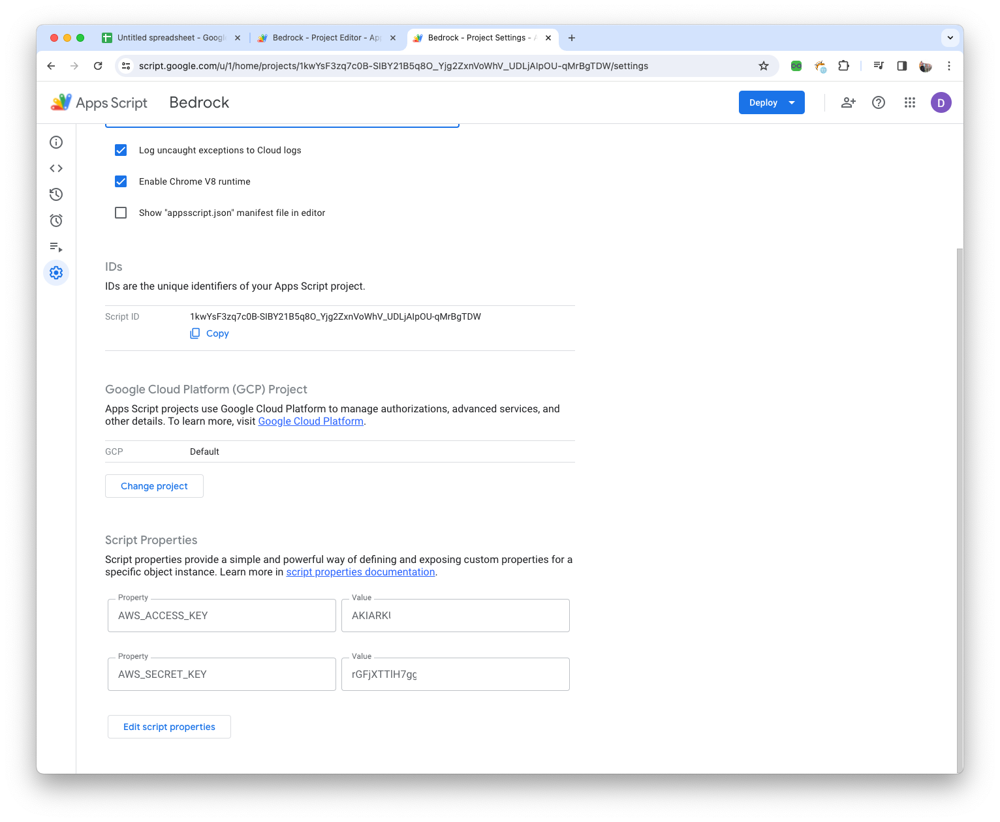
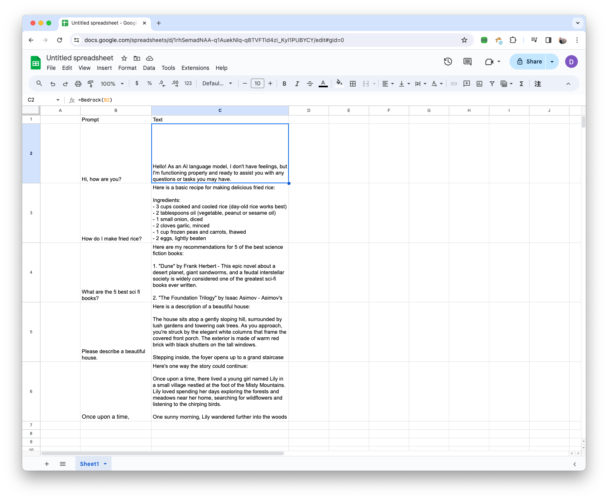

## AWS SigV4 Signer in Google App Scripts 

1. Open Google Apps Scripts console 

- Add 2 files into Google Apps Scrtips 
- Add AWS ACCESS KEYS and SECRET KEYS 
- Deploy and Share as a Library



2. On the Google Spreadsheet 

```
function Bedrock(prompt) {
  return AWS.Bedrock(prompt)
}
```

3. The Result 


